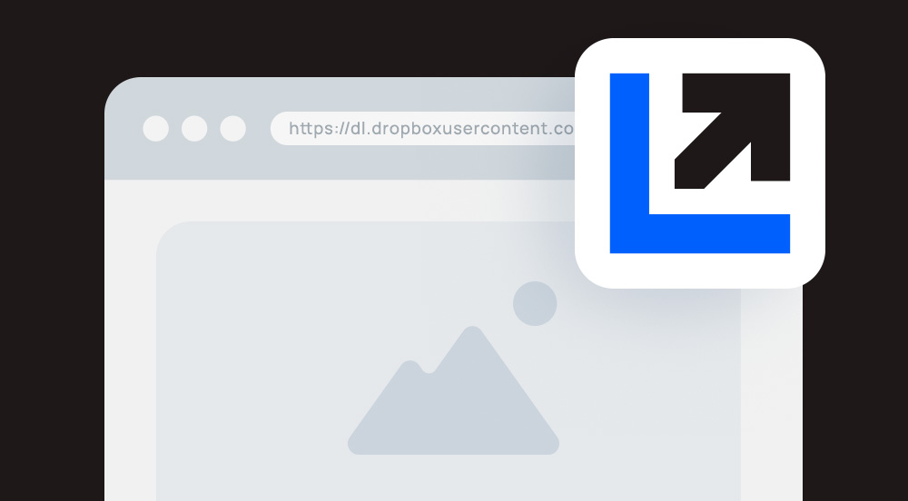

# Dropbox Direct Link Generator

A lightweight, fast, and privacy-first web tool designed to instantly convert standard Dropbox shared links (which lead to a web preview page) into direct download or direct browser-viewable formats.

**Live Demo:** [https://creold.github.io/dropbox-direct-link/](https://creold.github.io/dropbox-direct-link/)

## Key Features

- **100% Private (Privacy First):** All URL conversions are processed entirely client-side in your browser via JavaScript. No links or personal data are ever sent to external servers.
- **Bulk Processing:** Convert multiple links simultaneously by pasting them directly or uploading a `.txt` / `.csv` file list.
- **Export to CSV:** Save all processed URLs (Original, Download, and View links) into a structured CSV file with a single click.
- **Modern UI & Dark Theme:** Responsive layout with automatic system theme detection and manual light/dark switching.
- **Multilingual Support:** Switch seamlessly between English and Russian versions.

## How It Works

A standard Dropbox shared link:
`https://www.dropbox.com/s/xyz/file.jpg?dl=0`

Is converted into:
1. **Direct Download:** Modifies parameters to bypass the preview screen and start downloading the file immediately.
   `https://www.dropbox.com/s/xyz/file.jpg?dl=1`
2. **Direct View (Embed):** Routes the link to the user content subdomain to view or embed media files (images, audio, PDF) directly inside browsers or websites.
   `https://dl.dropboxusercontent.com/s/xyz/file.jpg`

## Support & Contribution
If you find this tool helpful, feel free to open an Issue or support development:

via [Buymeacoffee] `USD`, [CloudTips] `RUB`, [ЮMoney] `RUB`, [Tinkoff] `RUB`, [Donatty] `RUB`, or [DonatePay] `RUB`. Thank you.   

[Buymeacoffee]: https://www.buymeacoffee.com/aiscripts
[ЮMoney]: https://yoomoney.ru/to/410011149615582
[CloudTips]: https://pay.cloudtips.ru/p/b81d370e
[Tinkoff]: https://www.tinkoff.ru/rm/osokin.sergey127/SN67U9405
[Donatty]: https://donatty.com/sergosokin
[DonatePay]: https://new.donatepay.ru/@osokin

## License
This project is open-source and free to use, modify, or distribute.